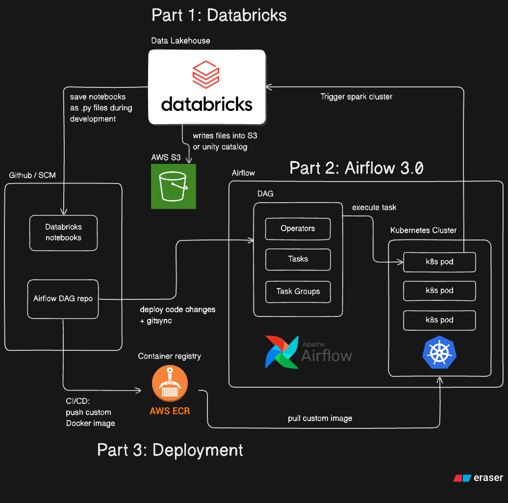

# Databricks and airflow 3.0 template

Supporting notes for Youtube tutorial: https://youtu.be/92X54U6gm0Y

Implements a bare-bones data platform using Databricks as Transformation tool, plus Airflow 3.0 on Kubernetes for orchestration, deployed on a local Kubernetes kind cluster.

Some batteries included features are:

- Data Aware orchestration using Data Assets
- Declarative transformation on top of Databricks notebooks
- Incremental upsert loading using Delta Lake
- Local kubernetes cluster running on Kind
- Data Quality checks using DQX library
- Git-sync sidecar to mount `/dag/` folders in your Airflow deployment
- Local Persistent Volume and Persistent Volume Claims for logging
- CI/CD using Github actions
- AWS ECR for container repository

## Installation

To set up a Kind cluster locally:

```bash
./install_airflow.sh
```

To install with persistent logs using PV/PVCs, run:

```bash
./install_airflow_with_persistence.sh
```

To install using AWS ECR to store your docker images, run:

```bash
./install_airflow_with_ecr.sh
```

Additionally, you will need to setup your personal access tokens / aws secrets for the following:

1. AWS IAM Service User access tokens
2. Databricks account personal access token
3. Git classic token for git-sync feature

To generate your secrets for git sync, use base64 encoding, i.e.

```bash
echo -n 'your_github_classic_token_here' | base64
echo -n 'your_github_username_token_here' | base64
```

```yaml
apiVersion: v1
kind: Secret
metadata:
  name: git-credentials
  namespace: airflow
data:
  GITSYNC_USERNAME: <base64 encoded user name here>
  GITSYNC_PASSWORD: <base64 encoded Git classic token here>
  GIT_SYNC_USERNAME: <base64 encoded user name here>
  GIT_SYNC_PASSWORD: <base64 encoded Git classic token here>
```

To enable CI/CD using github actions, set these two secret environment variables in your console:

```yaml
---
- name: Configure AWS Creds
  uses: aws-actions/configure-aws-credentials@v2
  with:
    aws-access-key-id: ${{ secrets.AWS_ACCESS_KEY_ID }}
    aws-secret-access-key: ${{ secrets.AWS_SECRET_ACCESS_KEY }}
    aws-region: us-east-1
```

## Architecture



## Disclaimer

Not production ready code - gives the reader a rough idea on how to deploy your own data platform.

Recommended to add more production ready features, such as running this on AWS EKS (Elastic Kubernetes Service), using S3 Remote for logging, replacing Airflow's Postgres instance with own Postgres server, keeping secrets in something like Vault or secrets manager and much more.
